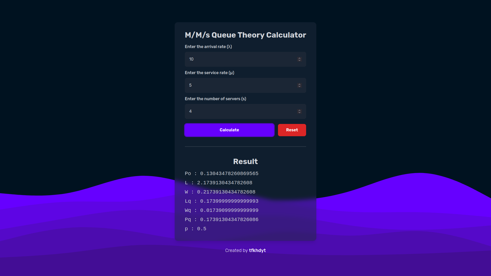

# M/M/s Queue Theory Calculator


Calculator to solve M/M/s queue theory problem, written in TypeScript and SvelteKit.

## Built with

- TypeScript
- SvelteKit
- Tailwind CSS
- Vitest

## Prerequisite

- [Node.js](https://nodejs.org/en/) (v18.13 or later)

## Installation

```bash
git clone https://github.com/tfkhdyt/mms-queue-theory-calculator
cd mms-queue-theory-calculator/
npm install
```

## Usage

- Start development server

```bash
npm run dev
```

- Build for production

```bash
npm run build
```

- Locally preview production build

```bash
npm run preview
```

## Preview



